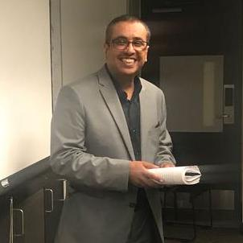

---
---

<link rel="stylesheet" href="styles.css" type="text/css">

I received my <strong>M.Sc.</strong> degree in Statistics (Mediacal Statistics pathway) from [Lancaster University](https://www.lancaster.ac.uk/maths/), Lancaster, England in 2009; followed by a <strong>Ph.D</strong> degree in Applied Statistics in 2018 from [University of Guelph](https://mathstat.uoguelph.ca/), Guelph, Canada. In my master degree, I worked on <strong>modelling the nasal carriage of Staphylococcus aurues in mothers and their infants over time</strong> (a longitudinal data study). In my Ph.D. thesis, I studied <strong>the incorporation of contact network uncertainty in individual level models of infectious disease using Markov chain Monte Carlo (MCMC) and approximate Bayesian computation methods</strong>.

I am the author and maintainer of an [R EpiILMCT](https://cran.r-project.org/web/packages/EpiILMCT/index.html) package, and an author of [R EpiILM](https://cran.r-project.org/web/packages/EpiILM/index.html) package. 

My full CV is available [here](files/cv-15.pdf).
